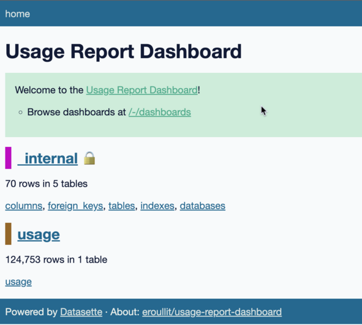

# usage-report-dashboard

> Dashboard implementation to display GitHub Actions usage statistics of an enterprise or a specific organization based on its usage report.

This tool will directly expose an SQL interface to the user, meaning the user is free to query, manipulate and refine data on its Actions usage.
Its usage is purely offline. It neither requires data to be sent to a third party nor does it use API calls to GitHub.

You [Usage Report CSV file](https://docs.github.com/en/enterprise-cloud%2540latest/billing/managing-billing-for-github-actions/viewing-your-github-actions-usage#viewing-github-actions-usage-for-your-enterprise-account) can be requested and sent to your email address.

## Use it in a Codespaces

### Start a Codespaces from this repository

[](https://github.com/codespaces/new/?repo=eroullit%2Fusage-report-dashboard&ref=main)

### Upload your Usage Report

Drag and drop your usage report in the explorer section of your Codespaces


### Prepare your Usage Report

Your usage report is a CSV file which must be converted as a database. A Task can be invoked to do this operation automatically.


Once the usage report has been selected, the conversion will start when once completed the dashboard will start automatically.
If the usage report has already been converted, the "Run Usage Report Dashboard" task can be used to directly start the dashboard based on existing data.

### Access your Dashboard





## Use it locally

### Installation

Install the project dependencies:

```bash
$ brew install datasette sqlite-utils
$ datasette install datasette-dashboards
```

### Usage

Once you have fetched your [Usage Report CSV file](https://docs.github.com/en/enterprise-cloud%2540latest/billing/managing-billing-for-github-actions/viewing-your-github-actions-usage#viewing-github-actions-usage-for-your-enterprise-account), the `usage-report2sql.sh` can be used to convert it to a SQLite database called `usage.db`:

```bash
$ ./usage-report2sql.sh usage-report.csv
```

Then, you can start the dashboard:

```bash
$ datasette usage.db --metadata metadata.yml
```

Large data sets might return more rows than the default value. It can be increase by starting it with:

```bash
$ datasette usage.db --metadata metadata.yml --setting max_returned_rows 200000
```

Once stated, the raw data is available locally at [http://127.0.0.1:8001](http://127.0.0.1:8001/) where as the charts can be displayed at [http://localhost:8001/-/dashboards/](http://localhost:8001/-/dashboards/)

### Modifications

If you want to modify the dashboard, you can edit the [`metadata.yml`](./metadata.yml) file and add your own charts.
